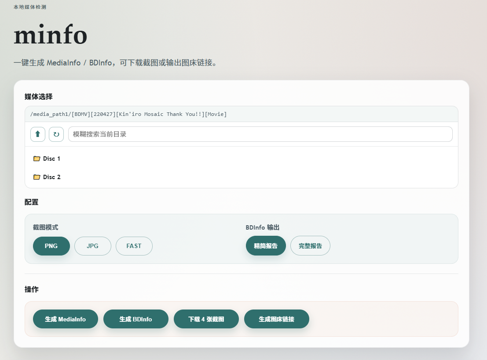

## 项目介绍

`minfo` 是一个本地媒体信息检测 Web 工具，主要功能：
- 输出 MediaInfo 信息
- 输出 BDInfo 信息
- 使用 guyuan 截图脚本



## 部署方式

直接使用已发布镜像 `ghcr.io/mirrorb/minfo:latest`。

示例 `docker-compose.yml`：

```yaml
services:
  minfo:
    image: ghcr.io/mirrorb/minfo:latest
    container_name: minfo
    privileged: true
    ports:
      - "28080:28080"
    environment:
      PORT: "28080"
      WEB_USERNAME: "admin"
      WEB_PASSWORD: "passpass" # 请修改默认用户名密码
      REQUEST_TIMEOUT: "20m"
    volumes:
      - /lib/modules:/lib/modules:ro # 用于挂载ISO，保持默认
      - /your/media/path1:/media_path1:ro
      - /your/media/path2:/media_path2:ro
    restart: unless-stopped
```

启动：

```bash
docker compose up -d
```
